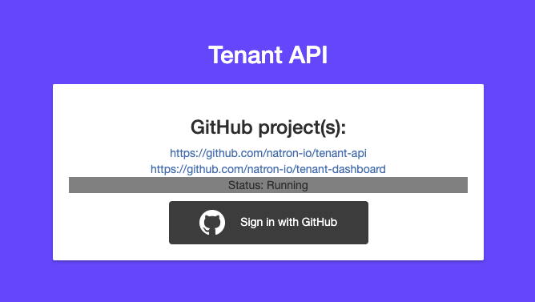

<p align="center">
  
</p>

# tenant-api
[](https://www.codefactor.io/repository/github/natron-io/tenant-api)
 
[](https://goreportcard.com/report/github.com/natron-io/tenant-api) 

 


API to present data to the [tenant-dashboard](https://github.com/natron-io/tenant-dashboard) with a GitHub oauth login.
Tenants represents the teams of a GitHub organization.

## api

#### `GET`
> **important:** for authenticated access you need to provide the `Authorization` header with the `Bearer` token.

You can add `<tenant name>` in front of the path to get the tenant specific data (of everything). 
> e.g. `/api/v1/<tenant name>/pods`
#### auth
`/login/github` - Login with GitHub \
`/login/github/callback` - Callback after GitHub login

##### general tenant resources
`/api/v1/pods` - Get pods of a tenant \
`/api/v1/namespaces` - Get namespaces of a tenant \
`/api/v1/serviceaccounts` - Get serviceaccounts of a tenant by namespaces \

##### specific tenant resources
`/api/v1/requests/cpu` - Get cpurequests in **Milicores** of a tenant \
`/api/v1/requests/memory` - Get memoryrequests in **Bytes** of a tenant \
`/api/v1/requests/storage` - Get storagerequests in **Bytes** of a tenant by storageclass \
`/api/v1/requests/ingress` - Get ingress ressources total of a tenant by ingressclass

##### tenant ressource costs
`/api/v1/costs/cpu` - Get the cpu costs by CPU \
`/api/v1/costs/memory` - Get the memory costs by Memory \
`/api/v1/costs/storage` - Get the storage costs by StorageClass \
`/api/v1/costs/ingress` - Get the ingress costs by tenant

#### `POST`

##### auth
You can send the github code with json body `{"github_code": "..."}` to the `/login/github` endpoint.
> The code you need to generate must have the `read:org` scope.

## env

### GitHub
> There are two ways for authenticating with GitHub. You can authenticate without a dashboard, so the github callback url is not the same as the dashboard.

`CLIENT_ID` - GitHub client id **required** \
`CLIENT_SECRET` - GitHub client secret **required** \
`CALLBACK_URL` - GitHub oauth callback url without path *optional* (default: "http://localhost:3000")

### auth
`SECRET_KEY` - JWT secret key *optional* (default: random 32 bytes, displayed in the logs)

### tenant ressource identifiers
`TENANT_LABEL` - label key for selecting tenant ressources *optional* (default: "natron.io/tenant")

### cost calculation values
`DISCOUNT_LABEL` - label key for selecting the discount value *optional* (default: "natron.io/discount" (float -> e.g. "0.1")) \
`CPU_COST` - Cost of a cpu in your currency *optional* (default: 1.00 for 1 CPU) \
`MEMORY_COST` - Cost of a memory in your currency *optional* (default: 1.00 for 1 GB) \
`STORAGE_COST_<storageclass name>` - Cost of your storage classes in your currency *optional, multiple allowed* (default: 1.00 for 1 GB) \
`INGRESS_COST` - Cost of ingress in your currency *optional* (default: 1.00 for 1 ingress)

## deployment
*example deployment files:* [kubernetes manifests](docs/kubernetes)

1. run a local minikube and apply a service account with clusterwide `view` permissions
```bash
minikube start
kubectl apply -f sa.yaml
kubectl apply -f rbac.yaml
kubectl apply -f deployment.yaml
kubectl expose deployment tenant-api --type=NodePort --port=8000

minikube service tenant-api
```
2. create a GitHub application in your GitHub organization and set the url (and port displayed at exposing the service via minikube) to the `CALLBACK_URL` (without path) and for the callback URL set the `CALLBACK_URL` with the path `/login/github/callback` (e.g. http://localhost:3000/login/github/callback)